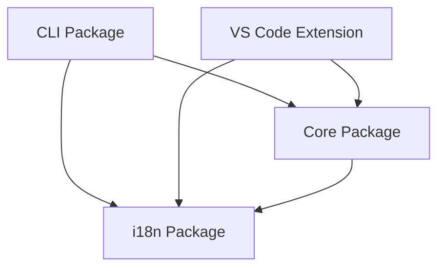
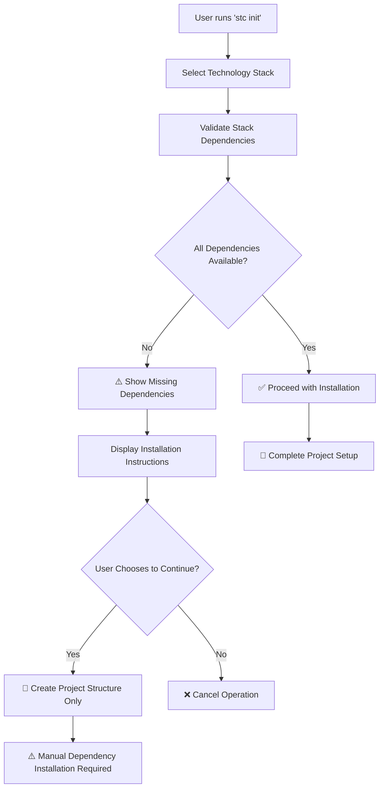

# StackCode Architecture

StackCode is a comprehensive DevOps toolkit designed as a monorepo with multiple interconnected packages. This document outlines the project's architecture, design principles, and component interactions.

## 🏗️ High-Level Architecture

StackCode follows a **modular monorepo architecture** with clear separation of concerns across different packages. The project is structured to maximize code reuse, maintainability, and extensibility.

```
┌─────────────────────────────────────────────────────────────┐
│                    StackCode Ecosystem                     │
├─────────────────────────────────────────────────────────────┤
│  CLI Package           │  VS Code Extension               │
│  (@stackcode/cli)      │  (stackcode-vscode)              │
│  ┌─────────────────┐   │  ┌─────────────────────────────┐ │
│  │ Command Layer   │   │  │ Extension Commands         │ │
│  │ ├─ init         │   │  │ ├─ Dashboard Provider       │ │
│  │ ├─ generate     │   │  │ ├─ File/Git Monitors        │ │
│  │ ├─ commit       │   │  │ ├─ Notification Manager     │ │
│  │ ├─ git          │   │  │ └─ Webview UI               │ │
│  │ ├─ release      │   │  └─────────────────────────────┘ │
│  │ ├─ validate     │   │                                  │
│  │ └─ config       │   │                                  │
│  └─────────────────┘   │                                  │
└─────────────────────────────────────────────────────────────┘
                             │
                             ▼
┌─────────────────────────────────────────────────────────────┐
│                   Shared Foundation                        │
├─────────────────────────────────────────────────────────────┤
│  Core Package          │  i18n Package                    │
│  (@stackcode/core)     │  (@stackcode/i18n)               │
│  ┌─────────────────┐   │  ┌─────────────────────────────┐ │
│  │ Business Logic  │   │  │ Internationalization       │ │
│  │ ├─ Generators   │   │  │ ├─ Locale Management        │ │
│  │ ├─ Validators   │   │  │ ├─ Translation System        │ │
│  │ ├─ GitHub API   │   │  │ └─ Language Detection       │ │
│  │ ├─ Release Mgmt │   │  └─────────────────────────────┘ │
│  │ ├─ Scaffolding  │   │                                  │
│  │ └─ Templates    │   │                                  │
│  └─────────────────┘   │                                  │
└─────────────────────────────────────────────────────────────┘
```

## 📦 Package Structure

### 1. **@stackcode/cli** - Command Line Interface

**Purpose:** Primary user interface for StackCode functionality.

**Key Components:**

- **Command Layer:** Entry points for all CLI operations
- **Command Handlers:** Individual command implementations
- **Interactive Prompts:** User guidance and input collection
- **Error Handling:** Consistent error reporting and recovery

**Architecture:**

```typescript
cli/
├── src/
│   ├── index.ts              # Main CLI entry point
│   ├── commands/             # Command implementations
│   │   ├── init.ts           # Project scaffolding
│   │   ├── generate.ts       # File generation
│   │   ├── commit.ts         # Conventional commits
│   │   ├── git.ts            # Git workflow management
│   │   ├── release.ts        # Version management
│   │   ├── validate.ts       # Commit validation
│   │   └── config.ts         # Configuration management
│   └── types/                # CLI-specific type definitions
└── test/                     # Command tests
```

### 2. **@stackcode/core** - Business Logic Engine

**Purpose:** Contains all business logic, utilities, and templates.

**Key Components:**

- **Generators:** Project and file generation logic
- **Validators:** Commit message validation and system dependency validation
- **GitHub Integration:** API interactions and automation
- **Release Management:** Semantic versioning and changelog generation
- **Template System:** Configurable project templates
- **Dependency Validation:** Intelligent system tool validation

**Architecture:**

```typescript
core/
├── src/
│   ├── index.ts              # Core exports
│   ├── generators.ts         # Project/file generators
│   ├── validator.ts          # Validation logic
│   ├── github.ts             # GitHub API integration
│   ├── release.ts            # Version management
│   ├── scaffold.ts           # Project scaffolding
│   ├── utils.ts              # Shared utilities
│   ├── types.ts              # Core type definitions
│   └── templates/            # Project templates
│       ├── common/           # Shared template files
│       ├── node-js/          # Node.js templates
│       ├── react/            # React templates
│       ├── vue/              # Vue.js templates
│       ├── python/           # Python templates
│       ├── java/             # Java templates
│       ├── go/               # Go templates
│       ├── php/              # PHP templates
│       ├── gitignore/        # .gitignore templates
│       └── readme/           # README templates
└── test/                     # Core logic tests
```

### 3. **@stackcode/i18n** - Internationalization

**Purpose:** Manages multi-language support across all packages.

**Features:**

- Dynamic locale detection
- Translation loading and caching
- Language switching
- Fallback mechanisms

**Architecture:**

```typescript
i18n/
├── src/
│   ├── index.ts              # i18n exports
│   └── locales/              # Translation files
│       ├── en.json           # English translations
│       └── pt.json           # Portuguese translations
```

### 4. **stackcode-vscode** - VS Code Extension

**Purpose:** Integrates StackCode functionality directly into VS Code.

**Key Components:**

- **Extension Commands:** VS Code command palette integration
- **File Monitors:** Real-time file change detection
- **Git Monitors:** Git state monitoring
- **Dashboard Provider:** Interactive project dashboard
- **Webview UI:** Rich user interface components
- **Notification System:** Proactive user guidance

**Architecture:**

```typescript
vscode-extension/
├── src/
│   ├── extension.ts          # Extension entry point
│   ├── commands/             # VS Code commands
│   ├── config/               # Configuration management
│   ├── monitors/             # File and Git monitoring
│   ├── notifications/        # Notification system
│   ├── providers/            # VS Code providers
│   ├── services/             # Extension services
│   └── webview-ui/           # React-based UI
└── test/                     # Extension tests
```

## 🔄 Data Flow and Interactions

### Command Execution Flow

1. **User Input:** CLI command or VS Code action
2. **Command Parsing:** Yargs (CLI) or VS Code API
3. **Core Logic:** Business logic execution in `@stackcode/core`
4. **i18n Processing:** Localized messages via `@stackcode/i18n`
5. **Output:** Results displayed to user

### Cross-Package Dependencies



## 🎯 Design Principles

### 1. **Separation of Concerns**

- **CLI Package:** User interface and command handling
- **Core Package:** Business logic and utilities
- **i18n Package:** Internationalization concerns
- **VS Code Extension:** IDE integration

### 2. **Dependency Inversion**

- Higher-level modules don't depend on lower-level modules
- Both depend on abstractions (interfaces)
- External dependencies are injected, not hardcoded

### 3. **Single Responsibility**

- Each package has a clearly defined purpose
- Functions and classes have single, well-defined responsibilities
- Templates are modular and composable

### 4. **Open/Closed Principle**

- System is open for extension (new templates, commands)
- Closed for modification (core logic remains stable)

## � System Validation Architecture

### Dependency Validation System

StackCode implements a comprehensive dependency validation system to ensure smooth project initialization across different technology stacks.

#### Core Components

**1. Command Availability Detection (`isCommandAvailable`)**

```typescript
// Cross-platform command detection
const isAvailable = await isCommandAvailable("go");
// Uses 'which' (Unix) or 'where' (Windows)
```

**2. Stack Dependency Mapping (`getStackDependencies`)**

```typescript
const stackMap = {
  go: ["go"],
  php: ["composer", "php"],
  java: ["mvn", "java"],
  python: ["pip", "python"],
  react: ["npm"],
  vue: ["npm"],
};
```

**3. Comprehensive Validation (`validateStackDependencies`)**

```typescript
const result = await validateStackDependencies("go");
// Returns: { isValid, missingDependencies, availableDependencies }
```

#### Validation Flow



#### Error Handling Strategy

- **Graceful Degradation:** Project creation succeeds even without dependencies
- **Informative Messaging:** Clear installation instructions with official URLs
- **User Choice:** Option to proceed or cancel when dependencies are missing
- **i18n Support:** Error messages localized in multiple languages

## �🛠️ Technology Stack

### Core Technologies

- **TypeScript:** Type safety and modern JavaScript features
- **Node.js:** Runtime environment
- **ESM:** Modern module system

### CLI-Specific

- **Yargs:** Command-line argument parsing
- **Inquirer:** Interactive command-line prompts

### VS Code Extension-Specific

- **VS Code API:** Extension development framework
- **React:** Webview UI components
- **Vite:** Build tool for webview assets

### Development Tools

- **Vitest/Jest:** Testing frameworks
- **ESLint:** Code linting
- **Prettier:** Code formatting
- **GitHub Actions:** CI/CD pipeline

## 📁 File Organization Strategy

### Monorepo Structure

```
StackCode/
├── packages/                 # All packages
│   ├── cli/                  # CLI package
│   ├── core/                 # Core business logic
│   ├── i18n/                 # Internationalization
│   └── vscode-extension/     # VS Code extension
├── docs/                     # Project documentation
├── scripts/                  # Build and utility scripts
└── types/                    # Shared type definitions
```

### Package Structure Conventions

Each package follows consistent patterns:

- `src/` - Source code
- `test/` - Test files
- `dist/` - Compiled output
- `package.json` - Package configuration
- `tsconfig.json` - TypeScript configuration
- `README.md` - Package documentation
- `CHANGELOG.md` - Version history

## 🔧 Build System

### TypeScript Compilation

- **Monorepo Build:** `tsc --build` for cross-package dependencies
- **Asset Copying:** Templates and locales copied to `dist/`
- **Executable Permissions:** CLI entry point marked as executable

### VS Code Extension Build

- **Extension Compilation:** TypeScript to JavaScript
- **Webview Build:** Vite for React components
- **Package Generation:** `.vsix` file creation

## 🧪 Testing Strategy

### Unit Testing

- **Core Logic:** Comprehensive tests for business logic
- **CLI Commands:** Command execution and error handling
- **Validators:** Input validation and error cases

### Integration Testing

- **Cross-Package:** Ensure packages work together
- **Template Generation:** Verify output correctness
- **GitHub Integration:** API interaction testing

## �️ Dependency Validation System

### Architecture Overview

StackCode includes an intelligent dependency validation system that prevents crashes and provides helpful guidance when required tools are missing.

### Components

#### 1. **Command Detection (`isCommandAvailable`)**

```typescript
// Checks if a command exists in system PATH
const isGoAvailable = await isCommandAvailable("go");
```

#### 2. **Stack Mapping (`getStackDependencies`)**

```typescript
// Maps each stack to its required tools
const goDeps = getStackDependencies("go"); // Returns: ['go']
const phpDeps = getStackDependencies("php"); // Returns: ['composer', 'php']
```

#### 3. **Validation Engine (`validateStackDependencies`)**

```typescript
// Comprehensive validation with detailed results
const result = await validateStackDependencies("go");
// Returns: { isValid: boolean, missingDependencies: string[], availableDependencies: string[] }
```

### Validation Flow

1. **Pre-Installation Check:** Before attempting dependency installation
2. **User Notification:** Clear warnings about missing tools
3. **Installation Guidance:** Direct links to download missing dependencies
4. **Graceful Degradation:** Option to continue without tools
5. **Error Handling:** Controlled failure instead of crashes

### Supported Stack Dependencies

| Stack                                | Required Tools    | Validation Status |
| ------------------------------------ | ----------------- | ----------------- |
| `go`                                 | `go`              | ✅                |
| `php`                                | `composer`, `php` | ✅                |
| `java`                               | `mvn`, `java`     | ✅                |
| `python`                             | `pip`, `python`   | ✅                |
| `node-js`, `node-ts`, `react`, `vue` | `npm`             | ✅                |

## �🚀 Deployment and Distribution

### NPM Packages

- **@stackcode/cli:** Published to NPM for global installation
- **@stackcode/core:** Internal package, not published separately
- **@stackcode/i18n:** Internal package, not published separately

### VS Code Extension

- **Marketplace:** Published to VS Code Marketplace
- **VSIX:** Direct installation package available

## 🔮 Extensibility Points

### Template System

- **Custom Templates:** Easy addition of new project types
- **Template Composition:** Combining multiple template sources
- **Dynamic Configuration:** Runtime template customization

### Command System

- **Plugin Architecture:** Future support for custom commands
- **Middleware Support:** Pre/post command hooks
- **Configuration Extension:** Custom validation and generation rules

## 📚 Additional Resources

- **[Contributing Guide](../CONTRIBUTING.md):** Development workflow and standards
- **[Stacks Documentation](STACKS.md):** Supported technology stacks
- **[Self-Hosting Guide](SELF_HOSTING_GUIDE.md):** Deployment options
- **[ADR Directory](adr/):** Architectural decision records
