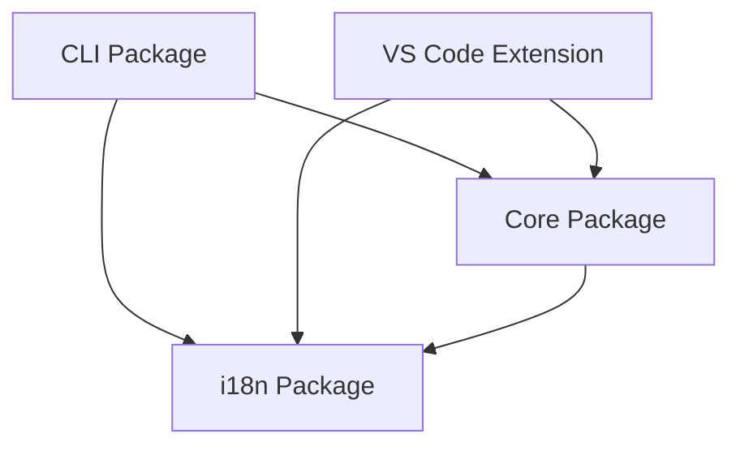

# Arquitectura de StackCode

StackCode es un kit de herramientas DevOps integral diseñado como un monorepo con múltiples paquetes interconectados. Este documento detalla la arquitectura del proyecto, principios de diseño e interacciones entre componentes.

## 🏗️ Arquitectura de Alto Nivel

StackCode sigue una **arquitectura de monorepo modular** con clara separación de responsabilidades entre diferentes paquetes. El proyecto está estructurado para maximizar la reutilización de código, mantenibilidad y extensibilidad.

```
┌─────────────────────────────────────────────────────────────┐
│                   Ecosistema StackCode                     │
├─────────────────────────────────────────────────────────────┤
│  Paquete CLI           │  Extensión VS Code               │
│  (@stackcode/cli)      │  (stackcode-vscode)              │
│  ┌─────────────────┐   │  ┌─────────────────────────────┐ │
│  │ Capa Comandos   │   │  │ Comandos de Extensión       │ │
│  │ ├─ init         │   │  │ ├─ Provider Dashboard        │ │
│  │ ├─ generate     │   │  │ ├─ Monitores File/Git        │ │
│  │ ├─ commit       │   │  │ ├─ Gestor Notificaciones     │ │
│  │ ├─ git          │   │  │ └─ UI Webview               │ │
│  │ ├─ release      │   │  └─────────────────────────────┘ │
│  │ ├─ validate     │   │                                  │
│  │ └─ config       │   │                                  │
│  └─────────────────┘   │                                  │
└─────────────────────────────────────────────────────────────┘
                             │
                             ▼
┌─────────────────────────────────────────────────────────────┐
│                   Fundación Compartida                     │
├─────────────────────────────────────────────────────────────┤
│  Paquete Core          │  Paquete i18n                    │
│  (@stackcode/core)     │  (@stackcode/i18n)               │
│  ┌─────────────────┐   │  ┌─────────────────────────────┐ │
│  │ Lógica Negocio  │   │  │ Internacionalización        │ │
│  │ ├─ Generadores  │   │  │ ├─ Gestión Locales          │ │
│  │ ├─ Validadores  │   │  │ ├─ Sistema Traducción        │ │
│  │ ├─ API GitHub   │   │  │ └─ Detección Idioma          │ │
│  │ ├─ Gest. Release│   │  └─────────────────────────────┘ │
│  │ ├─ Scaffolding  │   │                                  │
│  │ └─ Plantillas   │   │                                  │
│  └─────────────────┘   │                                  │
└─────────────────────────────────────────────────────────────┘
```

## 📦 Estructura de Paquetes

### 1. **@stackcode/cli** - Interfaz de Línea de Comandos

**Propósito:** Interfaz primaria del usuario para las funcionalidades de StackCode.

**Componentes Principales:**

- **Capa de Comandos:** Puntos de entrada para todas las operaciones CLI
- **Manejadores de Comandos:** Implementaciones de comandos individuales
- **Prompts Interactivos:** Orientación al usuario y recolección de entrada
- **Modo Educativo:** Sistema de aprendizaje contextual con explicaciones de mejores prácticas
- **Manejo de Errores:** Reporte de errores consistente y recuperación

**Arquitectura:**

```typescript
cli/
├── src/
│   ├── index.ts              # Punto de entrada principal CLI
│   ├── educational-mode.ts   # Gestión del modo educativo
│   ├── commands/             # Implementaciones de comandos
│   │   ├── init.ts           # Scaffolding de proyecto
│   │   ├── generate.ts       # Generación de archivos
│   │   ├── commit.ts         # Commits convencionales
│   │   ├── git.ts            # Gestión de flujo Git
│   │   ├── release.ts        # Gestión de versiones
│   │   ├── validate.ts       # Validación de commits
│   │   ├── config.ts         # Gestión de configuración
│   │   └── ui.ts             # Prompts interactivos y feedback
│   └── types/                # Definiciones de tipos específicos CLI
└── test/                     # Tests de comandos
```

### 2. **@stackcode/core** - Motor de Lógica de Negocio

**Propósito:** Contiene toda la lógica de negocio, utilidades y plantillas.

**Componentes Principales:**

- **Generadores:** Lógica de generación de proyectos y archivos
- **Validadores:** Validación de mensajes de commit y proyectos
- **Integración GitHub:** Interacciones API y automatización
- **Gestión de Releases:** Versionado semántico y generación de changelog
- **Sistema de Plantillas:** Plantillas de proyecto configurables

**Arquitectura:**

```typescript
core/
├── src/
│   ├── index.ts              # Exportaciones core
│   ├── generators.ts         # Generadores proyecto/archivo
│   ├── validator.ts          # Lógica de validación
│   ├── github.ts             # Integración API GitHub
│   ├── release.ts            # Gestión de versiones
│   ├── scaffold.ts           # Scaffolding de proyecto
│   ├── utils.ts              # Utilidades compartidas
│   ├── types.ts              # Definiciones de tipos core
│   └── templates/            # Plantillas de proyecto
│       ├── common/           # Archivos de plantilla compartidos
│       ├── node-js/          # Plantillas Node.js
│       ├── react/            # Plantillas React
│       ├── vue/              # Plantillas Vue.js
│       ├── python/           # Plantillas Python
│       ├── java/             # Java templates
│       ├── go/               # Go templates
│       ├── php/              # PHP templates
│       ├── gitignore/        # .gitignore templates
│       └── readme/           # README templates
└── test/                     # Core logic tests
```

### 3. **@stackcode/i18n** - Internacionalización

**Propósito:** Gestiona el soporte multiidioma en todos los paquetes.

**Features:**

- Dynamic locale detection
- Translation loading and caching
- Language switching
- Fallback mechanisms

**Architecture:**

```typescript
i18n/
├── src/
│   ├── index.ts              # i18n exports
│   └── locales/              # Translation files
│       ├── en.json           # English translations
│       └── pt.json           # Portuguese translations
```

### 4. **stackcode-vscode** - Extensión de VS Code

**Propósito:** Integra la funcionalidad de StackCode directamente en VS Code.

**Key Components:**

- **Extension Commands:** VS Code command palette integration
- **File Monitors:** Real-time file change detection
- **Git Monitors:** Git state monitoring
- **Dashboard Provider:** Interactive project dashboard
- **Webview UI:** Rich user interface components
- **Notification System:** Proactive user guidance

**Architecture:**

```typescript
vscode-extension/
├── src/
│   ├── extension.ts          # Extension entry point
│   ├── commands/             # VS Code commands
│   ├── config/               # Configuration management
│   ├── monitors/             # File and Git monitoring
│   ├── notifications/        # Notification system
│   ├── providers/            # VS Code providers
│   ├── services/             # Extension services
│   └── webview-ui/           # React-based UI
└── test/                     # Extension tests
```

## 🔄 Data Flow and Interactions

### Command Execution Flow

1. **User Input:** CLI command or VS Code action
2. **Command Parsing:** Yargs (CLI) or VS Code API
3. **Core Logic:** Business logic execution in `@stackcode/core`
4. **i18n Processing:** Localized messages via `@stackcode/i18n`
5. **Output:** Results displayed to user

### Cross-Package Dependencies



## 🎯 Design Principles

### 1. **Separation of Concerns**

- **CLI Package:** User interface and command handling
- **Core Package:** Business logic and utilities
- **i18n Package:** Internationalization concerns
- **VS Code Extension:** IDE integration

### 2. **Dependency Inversion**

- Higher-level modules don't depend on lower-level modules
- Both depend on abstractions (interfaces)
- External dependencies are injected, not hardcoded

### 3. **Single Responsibility**

- Each package has a clearly defined purpose
- Functions and classes have single, well-defined responsibilities
- Templates are modular and composable

### 4. **Open/Closed Principle**

- System is open for extension (new templates, commands)
- Closed for modification (core logic remains stable)

## 🛠️ Technology Stack

### Core Technologies

- **TypeScript:** Type safety and modern JavaScript features
- **Node.js:** Runtime environment
- **ESM:** Modern module system

### CLI-Specific

- **Yargs:** Command-line argument parsing
- **Inquirer:** Interactive command-line prompts

### VS Code Extension-Specific

- **VS Code API:** Extension development framework
- **React:** Webview UI components
- **Vite:** Build tool for webview assets

### Development Tools

- **Vitest/Jest:** Testing frameworks
- **ESLint:** Code linting
- **Prettier:** Code formatting
- **GitHub Actions:** CI/CD pipeline

## 📁 File Organization Strategy

### Monorepo Structure

```
StackCode/
├── packages/                 # All packages
│   ├── cli/                  # CLI package
│   ├── core/                 # Core business logic
│   ├── i18n/                 # Internationalization
│   └── vscode-extension/     # VS Code extension
├── docs/                     # Project documentation
├── scripts/                  # Build and utility scripts
└── types/                    # Shared type definitions
```

### Package Structure Conventions

Each package follows consistent patterns:

- `src/` - Source code
- `test/` - Test files
- `dist/` - Compiled output
- `package.json` - Package configuration
- `tsconfig.json` - TypeScript configuration
- `README.md` - Package documentation
- `CHANGELOG.md` - Version history

## 🔧 Build System

### TypeScript Compilation

- **Monorepo Build:** `tsc --build` for cross-package dependencies
- **Asset Copying:** Templates and locales copied to `dist/`
- **Executable Permissions:** CLI entry point marked as executable

### VS Code Extension Build

- **Extension Compilation:** TypeScript to JavaScript
- **Webview Build:** Vite for React components
- **Package Generation:** `.vsix` file creation

## 🧪 Testing Strategy

### Unit Testing

- **Core Logic:** Comprehensive tests for business logic
- **CLI Commands:** Command execution and error handling
- **Validators:** Input validation and error cases

### Integration Testing

- **Cross-Package:** Ensure packages work together
- **Template Generation:** Verify output correctness
- **GitHub Integration:** API interaction testing

## 🚀 Deployment and Distribution

### NPM Packages

- **@stackcode/cli:** Published to NPM for global installation
- **@stackcode/core:** Internal package, not published separately
- **@stackcode/i18n:** Internal package, not published separately

## 🎓 Arquitectura del Modo Educativo

### Resumen General

El Modo Educativo es una característica transversal que mejora la experiencia del usuario proporcionando explicaciones contextuales y orientación sobre mejores prácticas a través de todo el kit de herramientas StackCode.

### Implementación

```typescript
// Flujo del Modo Educativo
┌─────────────────┐    ┌─────────────────┐    ┌─────────────────┐
│ Comando Usuario │ -> │ Detección Modo  │ -> │ Mostrar Mensaj. │
│  --educate o    │    │ Config Global + │    │ Mejores Práctic.│
│ config global   │    │ Flag Comando    │    │ & Explicaciones │
└─────────────────┘    └─────────────────┘    └─────────────────┘
```

### Componentes Principales

- **`educational-mode.ts`:** Lógica central del modo educativo
  - `initEducationalMode()`: Detecta configuración y flags de comando
  - `showEducationalMessage()`: Muestra consejos contextuales
  - `showBestPractice()`: Muestra explicaciones de mejores prácticas
  - `showSecurityTip()`: Resalta consideraciones de seguridad

- **Integración de Configuración:**
  - Configuración global: `stackcode config set educate true/false`
  - Flag por comando: `--educate` en cualquier comando
  - Configuración interactiva vía `stackcode config`

- **Sistema de Mensajes:**
  - Explicaciones internacionalizadas (ES/PT/EN)
  - Mensajes de respaldo para confiabilidad
  - Contenido contextual basado en el comando

### Cobertura del Contenido Educativo

- **Inicialización de Proyectos:** Explica decisiones de scaffolding y dependencias
- **Generación de Archivos:** Describe propósito de .gitignore, README, etc.
- **Flujos Git:** Explica commits convencionales y beneficios del control de versiones
- **Prácticas de Seguridad:** Resalta importancia de .gitignore para secretos
- **Beneficios de Automatización:** Muestra valor de Husky, CI/CD y automatización de releases

### VS Code Extension

- **Marketplace:** Published to VS Code Marketplace
- **VSIX:** Direct installation package available

## 🔮 Extensibility Points

### Template System

- **Custom Templates:** Easy addition of new project types
- **Template Composition:** Combining multiple template sources
- **Dynamic Configuration:** Runtime template customization

### Command System

- **Plugin Architecture:** Soporte futuro para comandos personalizados
- **Middleware Support:** Hooks pre/post comando
- **Configuration Extension:** Reglas personalizadas de validación y generación

## 📚 Recursos Adicionales

- **[Guía de Contribución](../CONTRIBUTING.md):** Flujo de trabajo de desarrollo y estándares
- **[Documentación de Stacks](STACKS.md):** Stacks de tecnología soportados
- **[Guía de Auto-hospedaje](SELF_HOSTING_GUIDE.md):** Opciones de despliegue
- **[Directorio ADR](adr/):** Registros de decisión arquitectural
