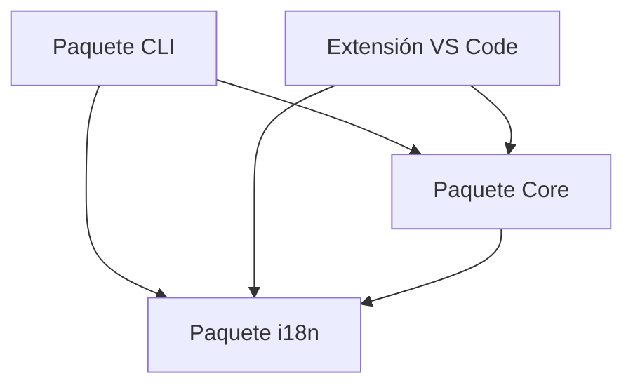
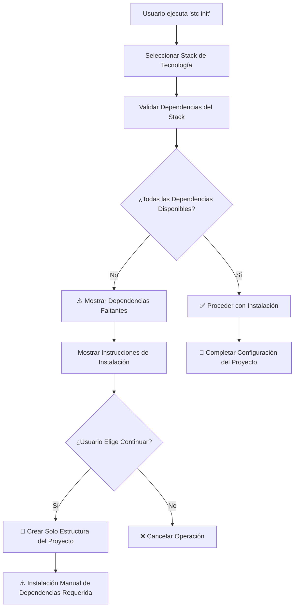

# Arquitectura de StackCode

StackCode es un kit de herramientas DevOps integral diseñado como un monorepo con múltiples paquetes interconectados. Este documento describe la arquitectura del proyecto, principios de diseño e interacciones entre componentes.

## 🏗️ Arquitectura de Alto Nivel

StackCode sigue una **arquitectura de monorepo modular** con clara separación de responsabilidades entre diferentes paquetes. El proyecto está estructurado para maximizar la reutilización de código, mantenibilidad y extensibilidad.

```
┌─────────────────────────────────────────────────────────────┐
│                    Ecosistema StackCode                    │
├─────────────────────────────────────────────────────────────┤
│  Paquete CLI           │  Extensión VS Code               │
│  (@stackcode/cli)      │  (stackcode-vscode)              │
│  ┌─────────────────┐   │  ┌─────────────────────────────┐ │
│  │ Capa Comando    │   │  │ Comandos de Extensión       │ │
│  │ ├─ init         │   │  │ ├─ Proveedor Dashboard       │ │
│  │ ├─ generate     │   │  │ ├─ Monitores File/Git        │ │
│  │ ├─ commit       │   │  │ ├─ Gestor Notificaciones     │ │
│  │ ├─ git          │   │  │ └─ UI Webview               │ │
│  │ ├─ release      │   │  └─────────────────────────────┘ │
│  │ ├─ validate     │   │                                  │
│  │ └─ config       │   │                                  │
│  └─────────────────┘   │                                  │
└─────────────────────────────────────────────────────────────┘
                             │
                             ▼
┌─────────────────────────────────────────────────────────────┐
│                   Fundación Compartida                     │
├─────────────────────────────────────────────────────────────┤
│  Paquete Core          │  Paquete i18n                    │
│  (@stackcode/core)     │  (@stackcode/i18n)               │
│  ┌─────────────────┐   │  ┌─────────────────────────────┐ │
│  │ Lógica Negocio  │   │  │ Internacionalización        │ │
│  │ ├─ Generadores  │   │  │ ├─ Gestión Locales           │ │
│  │ ├─ Validadores  │   │  │ ├─ Sistema Traducción        │ │
│  │ ├─ API GitHub   │   │  │ └─ Detección Idioma          │ │
│  │ ├─ Gest. Release│   │  └─────────────────────────────┘ │
│  │ ├─ Scaffolding  │   │                                  │
│  │ └─ Templates    │   │                                  │
│  └─────────────────┘   │                                  │
└─────────────────────────────────────────────────────────────┘
```

## 📦 Estructura de Paquetes

### 1. **@stackcode/cli** - Interfaz de Línea de Comandos

**Propósito:** Interfaz principal del usuario para funcionalidades de StackCode.

**Componentes Principales:**

- **Capa de Comandos:** Puntos de entrada para todas las operaciones CLI
- **Manejadores de Comandos:** Implementaciones de comandos individuales
- **Prompts Interactivos:** Orientación y recolección de entrada del usuario
- **Modo Educativo:** Sistema de aprendizaje contextual con explicaciones de mejores prácticas
- **Manejo de Errores:** Reporte de errores consistente y recuperación

**Arquitectura:**

```typescript
cli/
├── src/
│   ├── index.ts              # Punto de entrada principal de CLI
│   ├── educational-mode.ts   # Gestión del modo educativo
│   ├── commands/             # Implementaciones de comandos
│   │   ├── init.ts           # Scaffolding de proyecto
│   │   ├── generate.ts       # Generación de archivos
│   │   ├── commit.ts         # Commits convencionales
│   │   ├── git.ts            # Gestión de workflow Git
│   │   ├── release.ts        # Gestión de versiones
│   │   ├── validate.ts       # Validación de commits
│   │   ├── config.ts         # Gestión de configuración
│   │   └── ui.ts             # Prompts interactivos y retroalimentación
│   └── types/                # Definiciones de tipos específicos de CLI
└── test/                     # Pruebas de comandos
```

### 2. **@stackcode/core** - Motor de Lógica de Negocio

**Propósito:** Contiene toda la lógica de negocio, utilidades y templates.

**Componentes Principales:**

- **Generadores:** Lógica de generación de proyectos y archivos
- **Validadores:** Validación de mensajes de commit y dependencias del sistema
- **Integración GitHub:** Interacciones con API y automatización
- **Gestión de Releases:** Versionado semántico y generación de changelog
- **Sistema de Templates:** Templates de proyecto configurables
- **Validación de Dependencias:** Validación inteligente de herramientas del sistema

**Arquitectura:**

```typescript
core/
├── src/
│   ├── index.ts              # Exportaciones del core
│   ├── generators.ts         # Generadores de proyecto/archivo
│   ├── validator.ts          # Lógica de validación
│   ├── github.ts             # Integración con API GitHub
│   ├── release.ts            # Gestión de versiones
│   ├── scaffold.ts           # Scaffolding de proyecto
│   ├── utils.ts              # Utilidades compartidas
│   ├── types.ts              # Definiciones de tipos del core
│   └── templates/            # Templates de proyecto
│       ├── common/           # Archivos de template compartidos
│       ├── node-js/          # Templates Node.js
│       ├── react/            # Templates React
│       ├── vue/              # Templates Vue.js
│       ├── python/           # Templates Python
│       ├── java/             # Templates Java
│       ├── go/               # Templates Go
│       ├── php/              # Templates PHP
│       ├── gitignore/        # Templates .gitignore
│       └── readme/           # Templates README
└── test/                     # Pruebas de lógica del core
```

### 3. **@stackcode/i18n** - Internacionalización

**Propósito:** Gestiona soporte multi-idioma en todos los paquetes.

**Características:**

- Detección dinámica de locale
- Carga y caché de traducciones
- Cambio de idioma
- Mecanismos de fallback

**Arquitectura:**

```typescript
i18n/
├── src/
│   ├── index.ts              # Exportaciones i18n
│   └── locales/              # Archivos de traducción
│       ├── en.json           # Traducciones en inglés
│       └── pt.json           # Traducciones en portugués
```

### 4. **stackcode-vscode** - Extensión VS Code

**Propósito:** Integra funcionalidad de StackCode directamente en VS Code.

**Componentes Principales:**

- **Comandos de Extensión:** Integración con paleta de comandos de VS Code
- **Monitores de Archivo:** Detección de cambios en tiempo real
- **Monitores Git:** Monitoreo del estado de Git
- **Proveedor de Dashboard:** Dashboard interactivo del proyecto
- **UI Webview:** Componentes de interfaz rica
- **Sistema de Notificaciones:** Orientación proactiva al usuario

**Arquitectura:**

```typescript
vscode-extension/
├── src/
│   ├── extension.ts          # Punto de entrada de la extensión
│   ├── commands/             # Comandos de VS Code
│   ├── config/               # Gestión de configuración
│   ├── monitors/             # Monitoreo de archivos y Git
│   ├── notifications/        # Sistema de notificaciones
│   ├── providers/            # Proveedores de VS Code
│   ├── services/             # Servicios de la extensión
│   └── webview-ui/           # UI basada en React
└── test/                     # Pruebas de la extensión
```

## 🔄 Flujo de Datos e Interacciones

### Flujo de Ejecución de Comandos

1. **Entrada del Usuario:** Comando CLI o acción en VS Code
2. **Análisis de Comandos:** Yargs (CLI) o API de VS Code
3. **Lógica del Core:** Ejecución de lógica de negocio en `@stackcode/core`
4. **Procesamiento i18n:** Mensajes localizados vía `@stackcode/i18n`
5. **Salida:** Resultados mostrados al usuario

### Dependencias Entre Paquetes



## 🎯 Principios de Diseño

### 1. **Separación de Responsabilidades**

- **Paquete CLI:** Interfaz de usuario y manejo de comandos
- **Paquete Core:** Lógica de negocio y utilidades
- **Paquete i18n:** Preocupaciones de internacionalización
- **Extensión VS Code:** Integración con IDE

### 2. **Inversión de Dependencias**

- Módulos de alto nivel no dependen de módulos de bajo nivel
- Ambos dependen de abstracciones (interfaces)
- Dependencias externas son inyectadas, no hardcodeadas

### 3. **Responsabilidad Única**

- Cada paquete tiene un propósito claramente definido
- Funciones y clases tienen responsabilidades únicas y bien definidas
- Templates son modulares y componibles

### 4. **Principio Abierto/Cerrado**

- Sistema es abierto para extensión (nuevos templates, comandos)
- Cerrado para modificación (lógica del core permanece estable)

## 🔍 Arquitectura de Validación del Sistema

### Sistema de Validación de Dependencias

StackCode implementa un sistema integral de validación de dependencias para asegurar inicialización fluida de proyectos en diferentes stacks de tecnología.

#### Componentes Principales

**1. Detección de Disponibilidad de Comandos (`isCommandAvailable`)**

```typescript
// Detección de comando multiplataforma
const isAvailable = await isCommandAvailable("go");
// Usa 'which' (Unix) o 'where' (Windows)
```

**2. Mapeo de Dependencias de Stack (`getStackDependencies`)**

```typescript
const stackMap = {
  go: ["go"],
  php: ["composer", "php"],
  java: ["mvn", "java"],
  python: ["pip", "python"],
  react: ["npm"],
  vue: ["npm"],
};
```

**3. Validación Integral (`validateStackDependencies`)**

```typescript
const result = await validateStackDependencies("go");
// Retorna: { isValid, missingDependencies, availableDependencies }
```

#### Flujo de Validación



#### Estrategia de Manejo de Errores

- **Degradación Elegante:** Creación de proyecto exitosa incluso sin dependencias
- **Mensajes Informativos:** Instrucciones claras de instalación con URLs oficiales
- **Elección del Usuario:** Opción de proceder o cancelar cuando faltan dependencias
- **Soporte i18n:** Mensajes de error localizados en múltiples idiomas

## 🛠️ Stack de Tecnología

### Tecnologías Principales

- **TypeScript:** Seguridad de tipos y características modernas de JavaScript
- **Node.js:** Entorno de ejecución
- **ESM:** Sistema de módulos moderno

### Específicas de CLI

- **Yargs:** Análisis de argumentos de línea de comandos
- **Inquirer:** Prompts interactivos de línea de comandos

### Específicas de Extensión VS Code

- **API de VS Code:** Framework de desarrollo de extensiones
- **React:** Componentes UI para webview
- **Vite:** Herramienta de build para assets webview

### Herramientas de Desarrollo

- **Vitest/Jest:** Frameworks de pruebas
- **ESLint:** Linting de código
- **Prettier:** Formateo de código
- **GitHub Actions:** Pipeline CI/CD

## 📁 Estrategia de Organización de Archivos

### Estructura de Monorepo

```
StackCode/
├── packages/                 # Todos los paquetes
│   ├── cli/                  # Paquete CLI
│   ├── core/                 # Lógica de negocio principal
│   ├── i18n/                 # Internacionalización
│   └── vscode-extension/     # Extensión VS Code
├── docs/                     # Documentación del proyecto
├── scripts/                  # Scripts de build y utilidades
└── types/                    # Definiciones de tipos compartidos
```

### Convenciones de Estructura de Paquetes

Cada paquete sigue patrones consistentes:

- `src/` - Código fuente
- `test/` - Archivos de prueba
- `dist/` - Salida compilada
- `package.json` - Configuración del paquete
- `tsconfig.json` - Configuración TypeScript
- `README.md` - Documentación del paquete
- `CHANGELOG.md` - Historial de versiones

## 🔧 Sistema de Build

### Compilación TypeScript

- **Build de Monorepo:** `tsc --build` para dependencias entre paquetes
- **Copia de Assets:** Templates y locales copiados a `dist/`
- **Permisos de Ejecutable:** Punto de entrada CLI marcado como ejecutable

### Build de Extensión VS Code

- **Compilación de Extensión:** TypeScript a JavaScript
- **Build de Webview:** Vite para componentes React
- **Generación de Paquete:** Creación de archivo `.vsix`

## 🧪 Estrategia de Pruebas

### Pruebas Unitarias

- **Lógica del Core:** Pruebas integrales para lógica de negocio
- **Comandos CLI:** Ejecución de comandos y manejo de errores
- **Validadores:** Validación de entrada y casos de error

### Pruebas de Integración

- **Entre Paquetes:** Asegurar que los paquetes funcionen juntos
- **Generación de Templates:** Verificar corrección de la salida
- **Integración GitHub:** Pruebas de interacción con API

## ⚙️ Sistema de Validación de Dependencias

### Resumen de la Arquitectura

StackCode incluye un sistema inteligente de validación de dependencias que previene crashes y proporciona orientación útil cuando faltan herramientas requeridas.

### Componentes

#### 1. **Detección de Comandos (`isCommandAvailable`)**

```typescript
// Verifica si un comando existe en el PATH del sistema
const isGoAvailable = await isCommandAvailable("go");
```

#### 2. **Mapeo de Stacks (`getStackDependencies`)**

```typescript
// Mapea cada stack a sus herramientas requeridas
const goDeps = getStackDependencies("go"); // Retorna: ['go']
const phpDeps = getStackDependencies("php"); // Retorna: ['composer', 'php']
```

#### 3. **Motor de Validación (`validateStackDependencies`)**

```typescript
// Validación integral con resultados detallados
const result = await validateStackDependencies("go");
// Retorna: { isValid: boolean, missingDependencies: string[], availableDependencies: string[] }
```

### Flujo de Validación

1. **Verificación Pre-Instalación:** Antes de intentar instalación de dependencias
2. **Notificación del Usuario:** Advertencias claras sobre herramientas faltantes
3. **Orientación de Instalación:** Enlaces directos para descargar dependencias faltantes
4. **Degradación Elegante:** Opción de continuar sin herramientas
5. **Manejo de Errores:** Falla controlada en lugar de crashes

### Dependencias de Stacks Soportados

| Stack                                | Herramientas Requeridas | Estado de Validación |
| ------------------------------------ | ----------------------- | -------------------- |
| `go`                                 | `go`                    | ✅                   |
| `php`                                | `composer`, `php`       | ✅                   |
| `java`                               | `mvn`, `java`           | ✅                   |
| `python`                             | `pip`, `python`         | ✅                   |
| `node-js`, `node-ts`, `react`, `vue` | `npm`                   | ✅                   |

## 🎓 Arquitectura del Modo Educativo

### Resumen

El Modo Educativo es una característica transversal que mejora la experiencia del usuario proporcionando explicaciones contextuales y orientación sobre mejores prácticas en todo el kit de herramientas StackCode.

### Implementación

```typescript
// Flujo del Modo Educativo
┌─────────────────┐    ┌─────────────────┐    ┌─────────────────┐
│ Comando Usuario │ -> │ Detección Modo  │ -> │ Mostrar Mensajes│
│  --educate o    │    │ Config Global + │    │ Mejores Práctica│
│ config global   │    │ Flag Comando    │    │ & Explicaciones │
└─────────────────┘    └─────────────────┘    └─────────────────┘
```

### Componentes Principales

- **`educational-mode.ts`:** Lógica principal del modo educativo
  - `initEducationalMode()`: Detecta configuración y flags de comando
  - `showEducationalMessage()`: Muestra consejos contextuales
  - `showBestPractice()`: Muestra explicaciones de mejores prácticas
  - `showSecurityTip()`: Destaca consideraciones de seguridad

- **Integración de Configuración:**
  - Configuración global: `stackcode config set educate true/false`
  - Flag por comando: `--educate` en cualquier comando
  - Configuración interactiva vía `stackcode config`

- **Sistema de Mensajes:**
  - Explicaciones internacionalizadas (PT/EN)
  - Mensajes de fallback para confiabilidad
  - Contenido contextual basado en el comando

### Cobertura de Contenido Educativo

- **Inicialización de Proyectos:** Explica decisiones de scaffolding y dependencias
- **Generación de Archivos:** Describe propósito de .gitignore, README, etc.
- **Flujos Git:** Explica commits convencionales y beneficios del control de versiones
- **Prácticas de Seguridad:** Destaca importancia de .gitignore para secretos
- **Beneficios de Automatización:** Muestra valor de Husky, CI/CD y automatización de releases

## 🚀 Despliegue y Distribución

### Paquetes NPM

- **@stackcode/cli:** Publicado en NPM para instalación global
- **@stackcode/core:** Paquete interno, no publicado separadamente
- **@stackcode/i18n:** Paquete interno, no publicado separadamente

### Extensión VS Code

- **Marketplace:** Publicado en VS Code Marketplace
- **VSIX:** Paquete de instalación directa disponible

## 🔮 Puntos de Extensibilidad

### Sistema de Templates

- **Templates Personalizados:** Adición fácil de nuevos tipos de proyecto
- **Composición de Templates:** Combinando múltiples fuentes de template
- **Configuración Dinámica:** Personalización de template en tiempo de ejecución

### Sistema de Comandos

- **Arquitectura de Plugin:** Soporte futuro para comandos personalizados
- **Soporte de Middleware:** Hooks pre/post comando
- **Extensión de Configuración:** Reglas personalizadas de validación y generación

## 📚 Recursos Adicionales

- **[Guía de Contribución](../CONTRIBUTING.md):** Flujo de trabajo de desarrollo y estándares
- **[Documentación de Stacks](STACKS.md):** Stacks de tecnología soportados
- **[Guía de Auto-hospedaje](SELF_HOSTING_GUIDE.md):** Opciones de despliegue
- **[Directorio ADR](adr/):** Registros de decisión arquitecturaltectura de StackCode
