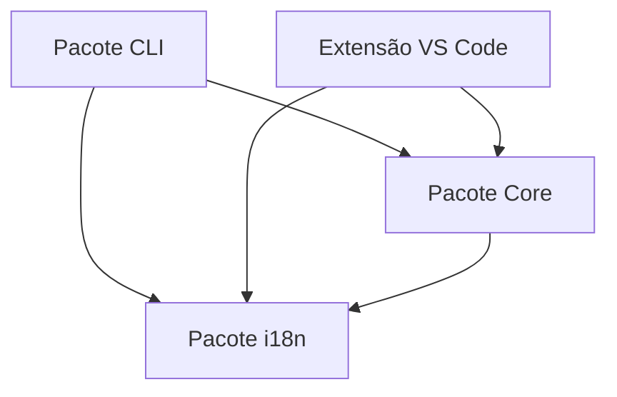
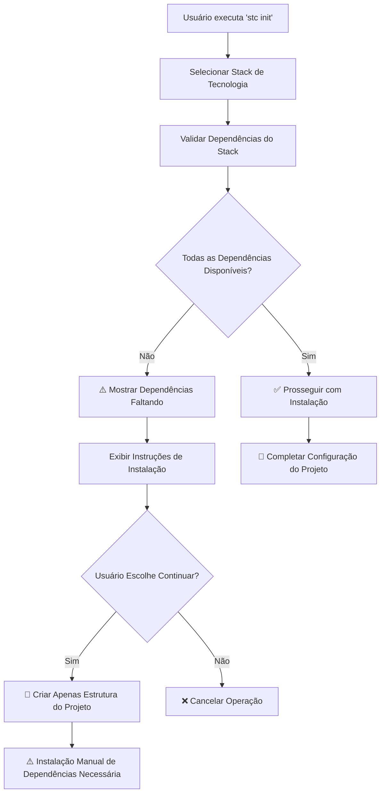

# Arquitetura do StackCode

O StackCode é um kit de ferramentas DevOps abrangente projetado como um monorepo com múltiplos pacotes interconectados. Este documento detalha a arquitetura do projeto, princípios de design e interações entre componentes.

## 🏗️ Arquitetura de Alto Nível

O StackCode segue uma **arquitetura de monorepo modular** com clara separação de responsabilidades entre diferentes pacotes. O projeto é estruturado para maximizar o reuso de código, manutenibilidade e extensibilidade.

```
┌─────────────────────────────────────────────────────────────┐
│                    Ecossistema StackCode                   │
├─────────────────────────────────────────────────────────────┤
│  Pacote CLI            │  Extensão VS Code                │
│  (@stackcode/cli)      │  (stackcode-vscode)              │
│  ┌─────────────────┐   │  ┌─────────────────────────────┐ │
│  │ Camada Comando  │   │  │ Comandos da Extensão        │ │
│  │ ├─ init         │   │  │ ├─ Provider Dashboard        │ │
│  │ ├─ generate     │   │  │ ├─ Monitores File/Git        │ │
│  │ ├─ commit       │   │  │ ├─ Gerenciador Notificação   │ │
│  │ ├─ git          │   │  │ └─ UI Webview               │ │
│  │ ├─ release      │   │  └─────────────────────────────┘ │
│  │ ├─ validate     │   │                                  │
│  │ └─ config       │   │                                  │
│  └─────────────────┘   │                                  │
└─────────────────────────────────────────────────────────────┘
                             │
                             ▼
┌─────────────────────────────────────────────────────────────┐
│                   Fundação Compartilhada                   │
├─────────────────────────────────────────────────────────────┤
│  Pacote Core           │  Pacote i18n                     │
│  (@stackcode/core)     │  (@stackcode/i18n)               │
│  ┌─────────────────┐   │  ┌─────────────────────────────┐ │
│  │ Lógica Negócio  │   │  │ Internacionalização         │ │
│  │ ├─ Geradores    │   │  │ ├─ Gerenciamento Locales     │ │
│  │ ├─ Validadores  │   │  │ ├─ Sistema Tradução          │ │
│  │ ├─ API GitHub   │   │  │ └─ Detecção Idioma           │ │
│  │ ├─ Gerenc. Rel. │   │  └─────────────────────────────┘ │
│  │ ├─ Scaffolding  │   │                                  │
│  │ └─ Templates    │   │                                  │
│  └─────────────────┘   │                                  │
└─────────────────────────────────────────────────────────────┘
```

## 📦 Estrutura de Pacotes

### 1. **@stackcode/cli** - Interface de Linha de Comando

**Propósito:** Interface primária do usuário para funcionalidades do StackCode.

**Componentes Principais:**

- **Camada de Comandos:** Pontos de entrada para todas as operações CLI
- **Manipuladores de Comandos:** Implementações de comandos individuais
- **Prompts Interativos:** Orientação e coleta de entrada do usuário
- **Modo Educacional:** Sistema de aprendizado contextual com explicações de melhores práticas
- **Tratamento de Erros:** Relatório de erros consistente e recuperação

**Arquitetura:**

```typescript
cli/
├── src/
│   ├── index.ts              # Ponto de entrada principal da CLI
│   ├── educational-mode.ts   # Gerenciamento do modo educacional
│   ├── commands/             # Implementações de comandos
│   │   ├── init.ts           # Scaffolding de projeto
│   │   ├── generate.ts       # Geração de arquivos
│   │   ├── commit.ts         # Commits convencionais
│   │   ├── git.ts            # Gerenciamento de workflow Git
│   │   ├── release.ts        # Gerenciamento de versão
│   │   ├── validate.ts       # Validação de commits
│   │   ├── config.ts         # Gerenciamento de configuração
│   │   └── ui.ts             # Prompts interativos e feedback
│   └── types/                # Definições de tipos específicos da CLI
└── test/                     # Testes de comandos
```

### 2. **@stackcode/core** - Motor de Lógica de Negócio

**Propósito:** Contém toda a lógica de negócio, utilitários e templates.

**Componentes Principais:**

- **Geradores:** Lógica de geração de projetos e arquivos
- **Validadores:** Validação de mensagens de commit e dependências do sistema
- **Integração GitHub:** Interações com API e automação
- **Gerenciamento de Release:** Versionamento semântico e geração de changelog
- **Sistema de Templates:** Templates de projeto configuráveis
- **Validação de Dependências:** Validação inteligente de ferramentas do sistema

**Arquitetura:**

```typescript
core/
├── src/
│   ├── index.ts              # Exportações do core
│   ├── generators.ts         # Geradores de projeto/arquivo
│   ├── validator.ts          # Lógica de validação
│   ├── github.ts             # Integração com API GitHub
│   ├── release.ts            # Gerenciamento de versão
│   ├── scaffold.ts           # Scaffolding de projeto
│   ├── utils.ts              # Utilitários compartilhados
│   ├── types.ts              # Definições de tipos do core
│   └── templates/            # Templates de projeto
│       ├── common/           # Arquivos de template compartilhados
│       ├── node-js/          # Templates Node.js
│       ├── react/            # Templates React
│       ├── vue/              # Templates Vue.js
│       ├── python/           # Templates Python
│       ├── java/             # Templates Java
│       ├── go/               # Templates Go
│       ├── php/              # Templates PHP
│       ├── gitignore/        # Templates .gitignore
│       └── readme/           # Templates README
└── test/                     # Testes de lógica do core
```

### 3. **@stackcode/i18n** - Internacionalização

**Propósito:** Gerencia suporte multi-idioma em todos os pacotes.

**Funcionalidades:**

- Detecção dinâmica de locale
- Carregamento e cache de traduções
- Troca de idioma
- Mecanismos de fallback

**Arquitetura:**

```typescript
i18n/
├── src/
│   ├── index.ts              # Exportações i18n
│   └── locales/              # Arquivos de tradução
│       ├── en.json           # Traduções em inglês
│       └── pt.json           # Traduções em português
```

### 4. **stackcode-vscode** - Extensão VS Code

**Propósito:** Integra funcionalidade do StackCode diretamente no VS Code.

**Componentes Principais:**

- **Comandos da Extensão:** Integração com paleta de comandos do VS Code
- **Monitores de Arquivo:** Detecção de mudanças em tempo real
- **Monitores Git:** Monitoramento do estado do Git
- **Provider de Dashboard:** Dashboard interativo do projeto
- **UI Webview:** Componentes de interface rica
- **Sistema de Notificações:** Orientação proativa ao usuário

**Arquitetura:**

```typescript
vscode-extension/
├── src/
│   ├── extension.ts          # Ponto de entrada da extensão
│   ├── commands/             # Comandos do VS Code
│   ├── config/               # Gerenciamento de configuração
│   ├── monitors/             # Monitoramento de arquivos e Git
│   ├── notifications/        # Sistema de notificações
│   ├── providers/            # Providers do VS Code
│   ├── services/             # Serviços da extensão
│   └── webview-ui/           # UI baseada em React
└── test/                     # Testes da extensão
```

## 🔄 Fluxo de Dados e Interações

### Fluxo de Execução de Comandos

1. **Entrada do Usuário:** Comando CLI ou ação no VS Code
2. **Análise de Comandos:** Yargs (CLI) ou API do VS Code
3. **Lógica do Core:** Execução da lógica de negócio em `@stackcode/core`
4. **Processamento i18n:** Mensagens localizadas via `@stackcode/i18n`
5. **Saída:** Resultados exibidos ao usuário

### Dependências Entre Pacotes



## 🎯 Princípios de Design

### 1. **Separação de Responsabilidades**

- **Pacote CLI:** Interface do usuário e manipulação de comandos
- **Pacote Core:** Lógica de negócio e utilitários
- **Pacote i18n:** Preocupações de internacionalização
- **Extensão VS Code:** Integração com IDE

### 2. **Inversão de Dependências**

- Módulos de alto nível não dependem de módulos de baixo nível
- Ambos dependem de abstrações (interfaces)
- Dependências externas são injetadas, não codificadas

### 3. **Responsabilidade Única**

- Cada pacote tem um propósito claramente definido
- Funções e classes têm responsabilidades únicas e bem definidas
- Templates são modulares e combináveis

### 4. **Princípio Aberto/Fechado**

- Sistema é aberto para extensão (novos templates, comandos)
- Fechado para modificação (lógica do core permanece estável)

## 🔍 Arquitetura de Validação do Sistema

### Sistema de Validação de Dependências

O StackCode implementa um sistema abrangente de validação de dependências para garantir inicialização suave de projetos em diferentes stacks de tecnologia.

#### Componentes Principais

**1. Detecção de Disponibilidade de Comandos (`isCommandAvailable`)**

```typescript
// Detecção de comando multiplataforma
const isAvailable = await isCommandAvailable("go");
// Usa 'which' (Unix) ou 'where' (Windows)
```

**2. Mapeamento de Dependências de Stack (`getStackDependencies`)**

```typescript
const stackMap = {
  go: ["go"],
  php: ["composer", "php"],
  java: ["mvn", "java"],
  python: ["pip", "python"],
  react: ["npm"],
  vue: ["npm"],
};
```

**3. Validação Abrangente (`validateStackDependencies`)**

```typescript
const result = await validateStackDependencies("go");
// Retorna: { isValid, missingDependencies, availableDependencies }
```

#### Fluxo de Validação



#### Estratégia de Tratamento de Erros

- **Degradação Graciosa:** Criação de projeto é bem-sucedida mesmo sem dependências
- **Mensagens Informativas:** Instruções claras de instalação com URLs oficiais
- **Escolha do Usuário:** Opção de prosseguir ou cancelar quando dependências estão faltando
- **Suporte i18n:** Mensagens de erro localizadas em múltiplos idiomas

## 🛠️ Stack de Tecnologia

### Tecnologias Principais

- **TypeScript:** Segurança de tipos e recursos modernos do JavaScript
- **Node.js:** Ambiente de execução
- **ESM:** Sistema de módulos moderno

### Específicas da CLI

- **Yargs:** Análise de argumentos de linha de comando
- **Inquirer:** Prompts interativos de linha de comando

### Específicas da Extensão VS Code

- **API do VS Code:** Framework de desenvolvimento de extensões
- **React:** Componentes UI para webview
- **Vite:** Ferramenta de build para assets webview

### Ferramentas de Desenvolvimento

- **Vitest/Jest:** Frameworks de teste
- **ESLint:** Linting de código
- **Prettier:** Formatação de código
- **GitHub Actions:** Pipeline CI/CD

## 📁 Estratégia de Organização de Arquivos

### Estrutura de Monorepo

```
StackCode/
├── packages/                 # Todos os pacotes
│   ├── cli/                  # Pacote CLI
│   ├── core/                 # Lógica de negócio principal
│   ├── i18n/                 # Internacionalização
│   └── vscode-extension/     # Extensão VS Code
├── docs/                     # Documentação do projeto
├── scripts/                  # Scripts de build e utilitários
└── types/                    # Definições de tipos compartilhados
```

### Convenções de Estrutura de Pacotes

Cada pacote segue padrões consistentes:

- `src/` - Código fonte
- `test/` - Arquivos de teste
- `dist/` - Saída compilada
- `package.json` - Configuração do pacote
- `tsconfig.json` - Configuração TypeScript
- `README.md` - Documentação do pacote
- `CHANGELOG.md` - Histórico de versões

## 🔧 Sistema de Build

### Compilação TypeScript

- **Build de Monorepo:** `tsc --build` para dependências entre pacotes
- **Cópia de Assets:** Templates e locales copiados para `dist/`
- **Permissões de Executável:** Ponto de entrada CLI marcado como executável

### Build da Extensão VS Code

- **Compilação da Extensão:** TypeScript para JavaScript
- **Build de Webview:** Vite para componentes React
- **Geração de Pacote:** Criação de arquivo `.vsix`

## 🧪 Estratégia de Testes

### Testes Unitários

- **Lógica do Core:** Testes abrangentes para lógica de negócio
- **Comandos CLI:** Execução de comandos e tratamento de erros
- **Validadores:** Validação de entrada e casos de erro

### Testes de Integração

- **Entre Pacotes:** Garantir que pacotes funcionem juntos
- **Geração de Templates:** Verificar correção da saída
- **Integração GitHub:** Teste de interação com API

## ⚙️ Sistema de Validação de Dependências

### Visão Geral da Arquitetura

O StackCode inclui um sistema inteligente de validação de dependências que previne crashes e fornece orientação útil quando ferramentas necessárias estão faltando.

### Componentes

#### 1. **Detecção de Comandos (`isCommandAvailable`)**

```typescript
// Verifica se um comando existe no PATH do sistema
const isGoAvailable = await isCommandAvailable("go");
```

#### 2. **Mapeamento de Stacks (`getStackDependencies`)**

```typescript
// Mapeia cada stack para suas ferramentas necessárias
const goDeps = getStackDependencies("go"); // Retorna: ['go']
const phpDeps = getStackDependencies("php"); // Retorna: ['composer', 'php']
```

#### 3. **Motor de Validação (`validateStackDependencies`)**

```typescript
// Validação abrangente com resultados detalhados
const result = await validateStackDependencies("go");
// Retorna: { isValid: boolean, missingDependencies: string[], availableDependencies: string[] }
```

### Fluxo de Validação

1. **Verificação Pré-Instalação:** Antes de tentar instalação de dependências
2. **Notificação do Usuário:** Avisos claros sobre ferramentas faltando
3. **Orientação de Instalação:** Links diretos para baixar dependências faltando
4. **Degradação Graciosa:** Opção de continuar sem ferramentas
5. **Tratamento de Erros:** Falha controlada ao invés de crashes

### Dependências de Stacks Suportados

| Stack                                | Ferramentas Necessárias | Status da Validação |
| ------------------------------------ | ----------------------- | ------------------- |
| `go`                                 | `go`                    | ✅                  |
| `php`                                | `composer`, `php`       | ✅                  |
| `java`                               | `mvn`, `java`           | ✅                  |
| `python`                             | `pip`, `python`         | ✅                  |
| `node-js`, `node-ts`, `react`, `vue` | `npm`                   | ✅                  |

## 🎓 Arquitetura do Modo Educacional

### Visão Geral

O Modo Educacional é um recurso transversal que aprimora a experiência do usuário fornecendo explicações contextuais e orientação sobre melhores práticas em todo o kit de ferramentas StackCode.

### Implementação

```typescript
// Fluxo do Modo Educacional
┌─────────────────┐    ┌─────────────────┐    ┌─────────────────┐
│ Comando Usuário │ -> │ Detecção Modo   │ -> │ Exibir Mensagens│
│  --educate ou   │    │ Config Global + │    │ Melhores Práticas│
│ config global   │    │ Flag Comando    │    │ & Explicações   │
└─────────────────┘    └─────────────────┘    └─────────────────┘
```

### Componentes Principais

- **`educational-mode.ts`:** Lógica principal do modo educacional
  - `initEducationalMode()`: Detecta configuração e flags de comando
  - `showEducationalMessage()`: Exibe dicas contextuais
  - `showBestPractice()`: Mostra explicações de melhores práticas
  - `showSecurityTip()`: Destaca considerações de segurança

- **Integração de Configuração:**
  - Configuração global: `stackcode config set educate true/false`
  - Flag por comando: `--educate` em qualquer comando
  - Configuração interativa via `stackcode config`

- **Sistema de Mensagens:**
  - Explicações internacionalizadas (PT/EN)
  - Mensagens de fallback para confiabilidade
  - Conteúdo contextual baseado no comando

### Cobertura de Conteúdo Educacional

- **Inicialização de Projetos:** Explica decisões de scaffolding e dependências
- **Geração de Arquivos:** Descreve propósito de .gitignore, README, etc.
- **Fluxos Git:** Explica commits convencionais e benefícios do controle de versão
- **Práticas de Segurança:** Destaca importância do .gitignore para segredos
- **Benefícios da Automação:** Mostra valor do Husky, CI/CD e automação de releases

## 🚀 Implantação e Distribuição

### Pacotes NPM

- **@stackcode/cli:** Publicado no NPM para instalação global
- **@stackcode/core:** Pacote interno, não publicado separadamente
- **@stackcode/i18n:** Pacote interno, não publicado separadamente

### Extensão VS Code

- **Marketplace:** Publicado no VS Code Marketplace
- **VSIX:** Pacote de instalação direta disponível

## 🔮 Pontos de Extensibilidade

### Sistema de Templates

- **Templates Personalizados:** Adição fácil de novos tipos de projeto
- **Composição de Templates:** Combinando múltiplas fontes de template
- **Configuração Dinâmica:** Personalização de template em tempo de execução

### Sistema de Comandos

- **Arquitetura de Plugin:** Suporte futuro para comandos personalizados
- **Suporte a Middleware:** Hooks pré/pós comando
- **Extensão de Configuração:** Regras personalizadas de validação e geração

## 📚 Recursos Adicionais

- **[Guia de Contribuição](../CONTRIBUTING.md):** Fluxo de trabalho de desenvolvimento e padrões
- **[Documentação de Stacks](STACKS.md):** Stacks de tecnologia suportados
- **[Guia de Auto-hospedagem](SELF_HOSTING_GUIDE.md):** Opções de implantação
- **[Diretório ADR](adr/):** Registros de decisão arquitetural
