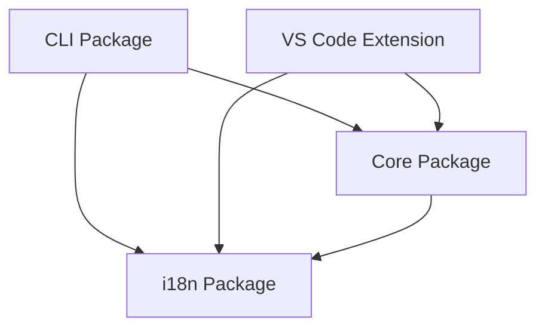

# Arquitetura do StackCode

O StackCode é um kit de ferramentas DevOps abrangente projetado como um monorepo com múltiplos pacotes interconectados. Este documento detalha a arquitetura do projeto, princípios de design e interações entre componentes.

## 🏗️ Arquitetura de Alto Nível

O StackCode segue uma **arquitetura de monorepo modular** com clara separação de responsabilidades entre diferentes pacotes. O projeto é estruturado para maximizar o reuso de código, manutenibilidade e extensibilidade.

```
┌─────────────────────────────────────────────────────────────┐
│                   Ecossistema StackCode                    │
├─────────────────────────────────────────────────────────────┤
│  Pacote CLI            │  Extensão VS Code                │
│  (@stackcode/cli)      │  (stackcode-vscode)              │
│  ┌─────────────────┐   │  ┌─────────────────────────────┐ │
│  │ Camada Comando  │   │  │ Comandos da Extensão        │ │
│  │ ├─ init         │   │  │ ├─ Provider Dashboard        │ │
│  │ ├─ generate     │   │  │ ├─ Monitores File/Git        │ │
│  │ ├─ commit       │   │  │ ├─ Gerenciador Notificação   │ │
│  │ ├─ git          │   │  │ └─ UI Webview               │ │
│  │ ├─ release      │   │  └─────────────────────────────┘ │
│  │ ├─ validate     │   │                                  │
│  │ └─ config       │   │                                  │
│  └─────────────────┘   │                                  │
└─────────────────────────────────────────────────────────────┘
                             │
                             ▼
┌─────────────────────────────────────────────────────────────┐
│                   Fundação Compartilhada                   │
├─────────────────────────────────────────────────────────────┤
│  Pacote Core           │  Pacote i18n                     │
│  (@stackcode/core)     │  (@stackcode/i18n)               │
│  ┌─────────────────┐   │  ┌─────────────────────────────┐ │
│  │ Lógica Negócio  │   │  │ Internacionalização         │ │
│  │ ├─ Geradores    │   │  │ ├─ Gerenciamento Locales     │ │
│  │ ├─ Validadores  │   │  │ ├─ Sistema Tradução          │ │
│  │ ├─ API GitHub   │   │  │ └─ Detecção Idioma           │ │
│  │ ├─ Gerenc. Rel. │   │  └─────────────────────────────┘ │
│  │ ├─ Scaffolding  │   │                                  │
│  │ └─ Templates    │   │                                  │
│  └─────────────────┘   │                                  │
└─────────────────────────────────────────────────────────────┘
```

## 📦 Estrutura de Pacotes

### 1. **@stackcode/cli** - Interface de Linha de Comando

**Propósito:** Interface primária do usuário para funcionalidades do StackCode.

**Componentes Principais:**

- **Comandos**: Implementações dos comandos CLI (`init`, `generate`, `commit`, etc.)
- **Manipuladores de Argumentos**: Parsing e validação de argumentos usando Yargs
- **Utilitários**: Funções auxiliares específicas da CLI

**Responsabilidades:**

- Parsing de argumentos de linha de comando
- Interação com o usuário via terminal
- Orquestração de chamadas para o pacote core
- Tratamento de erros e apresentação de resultados

### 2. **@stackcode/core** - Lógica de Negócio Central

**Propósito:** Implementa toda a lógica de negócio principal e funcionalidades centrais.

**Componentes Principais:**

- **Geradores**: Criação de projetos a partir de templates
- **Validadores**: Validação de código e configurações
- **Integração GitHub**: API e funcionalidades de integração
- **Gerenciamento de Release**: Automação de release de versões
- **Sistema de Templates**: Mecanismo de scaffolding e templates
- **Utilitários**: Funções compartilhadas entre pacotes

**Responsabilidades:**

- Processamento de templates e scaffolding
- Integração com APIs externas (GitHub)
- Validação de estruturas de projeto
- Geração automática de documentação
- Gerenciamento de dependências e configurações

### 3. **@stackcode/i18n** - Internacionalização

**Propósito:** Fornece suporte multi-idioma para toda a suite StackCode.

**Componentes Principais:**

- **Gerenciador de Locales**: Carregamento e gerenciamento de traduções
- **Sistema de Tradução**: API de tradução e fallbacks
- **Detecção de Idioma**: Detecção automática do idioma preferido do usuário

**Responsabilidades:**

- Carregamento de arquivos de tradução
- Fornecimento de strings localizadas
- Gerenciamento de idiomas suportados
- Fallback para idioma padrão quando necessário

### 4. **stackcode-vscode** - Extensão VS Code

**Propósito:** Integração nativa com VS Code para experiência de desenvolvimento aprimorada.

**Componentes Principais:**

- **Comandos da Extensão**: Comandos VS Code que utilizam funcionalidades do StackCode
- **Providers**: Providers de dashboard, tree view e webview
- **Monitores**: Monitoramento de arquivos e mudanças do Git
- **Gerenciador de Notificações**: Sistema de notificações proativas
- **UI Webview**: Interface de usuário rica baseada na web

**Responsabilidades:**

- Integração com comandos VS Code
- Monitoramento de atividade do workspace
- Fornecimento de UI rica via webviews
- Notificações contextuais e proativas

## 🔄 Fluxo de Dados e Interações

### Fluxo Típico de Comando CLI

```
Usuário → CLI Input → Yargs Parser → Command Handler → @stackcode/core → Execução → Resultado
```

### Fluxo da Extensão VS Code

```
Ação do Usuário → Comando VS Code → Extension Handler → @stackcode/core → Atualização UI → Feedback Visual
```

### Fluxo de Internacionalização

```
Solicitação de String → i18n Manager → Carregamento de Locale → String Traduzida → Interface do Usuário
```

## 🎯 Princípios de Design

### 1. **Separação de Responsabilidades**

Cada pacote tem responsabilidades claramente definidas:

- **CLI**: Interação com usuário e parsing de comandos
- **Core**: Lógica de negócio e processamento
- **i18n**: Localização e traduções
- **VSCode**: Integração com editor e UI rica

### 2. **Reutilização de Código**

- Funcionalidades centrais ficam no pacote `@stackcode/core`
- Interfaces (CLI e VS Code) consomem a mesma lógica de negócio
- Sistema de templates compartilhado entre todos os pontos de entrada

### 3. **Extensibilidade**

- Sistema de templates permite adição fácil de novos stacks
- Arquitetura de plugins para extensões futuras
- APIs bem definidas entre pacotes

### 4. **Type Safety**

- TypeScript em todo o projeto
- Tipos compartilhados entre pacotes
- Validação de runtime com schemas quando necessário

### 5. **Testabilidade**

- Unidades testáveis pequenas e focadas
- Mocking de dependências externas
- Testes de integração entre pacotes

## 🔧 Tecnologias e Dependências

### Tecnologias Core

- **TypeScript**: Linguagem principal para type safety
- **Node.js**: Runtime para CLI e extensão
- **ESM**: Módulos ES para estrutura moderna
- **Yargs**: Biblioteca CLI para parsing de argumentos

### Ferramentas de Build

- **TypeScript Compiler**: Transpilação de TypeScript
- **ESBuild**: Bundling rápido para a extensão VS Code
- **npm workspaces**: Gerenciamento de monorepo

### Testes e Qualidade

- **Jest**: Framework de testes principal
- **ESLint**: Linting de código
- **Prettier**: Formatação de código

### Integrações Externas

- **GitHub API**: Para funcionalidades de repositório
- **VS Code API**: Para integração com editor
- **npm registry**: Para publicação de pacotes

## 📁 Organização de Código

### Estrutura de Diretórios

```
packages/
├── cli/                    # Interface linha de comando
│   ├── src/
│   │   ├── commands/       # Implementações de comandos
│   │   ├── types/          # Tipos específicos da CLI
│   │   └── index.ts        # Ponto de entrada
│   └── test/               # Testes da CLI
├── core/                   # Lógica de negócio principal
│   ├── src/
│   │   ├── templates/      # Templates de projeto
│   │   ├── generators.ts   # Lógica de geração
│   │   ├── validator.ts    # Sistema de validação
│   │   └── types.ts        # Tipos compartilhados
│   └── test/               # Testes do core
├── i18n/                   # Sistema de internacionalização
│   ├── src/
│   │   ├── locales/        # Arquivos de tradução
│   │   └── index.ts        # API de i18n
│   └── test/               # Testes de i18n
└── vscode-extension/       # Extensão VS Code
    ├── src/
    │   ├── commands/       # Comandos da extensão
    │   ├── providers/      # Providers VS Code
    │   ├── webview-ui/     # Interface webview
    │   └── extension.ts    # Ponto de entrada
    └── test/               # Testes da extensão
```

### Convenções de Nomenclatura

- **Arquivos**: camelCase para arquivos TypeScript
- **Classes**: PascalCase para classes e interfaces
- **Constantes**: UPPER_SNAKE_CASE para constantes
- **Funções**: camelCase para funções e métodos

## 🔒 Considerações de Segurança

### Validação de Input

- Todas as entradas do usuário são validadas e sanitizadas
- Uso de esquemas de validação onde apropriado
- Prevenção de path traversal em operações de arquivo

### Gerenciamento de Dependências

- Auditoria regular de dependências para vulnerabilidades
- Pinning de versões de dependências críticas
- Uso de dependências mínimas necessárias

### Tratamento de Dados Sensíveis

- Tokens e credenciais nunca são logados
- Uso de variáveis de ambiente para dados sensíveis
- Criptografia para dados persistidos quando necessário

## 🚀 Estratégia de Release

### Versionamento

- **Semantic Versioning**: Major.Minor.Patch
- **Versões Synchronized**: Todos os pacotes mantêm versão sincronizada
- **Changelog**: Changelog detalhado para cada release

### Pipeline de Release

1. **Desenvolvimento**: Feature branches com PRs
2. **Testes**: CI/CD automatizado com testes completos
3. **Staging**: Release candidates para testes
4. **Produção**: Release para npm registry
5. **Documentação**: Atualização de docs e guias

### Compatibilidade

- **Breaking Changes**: Apenas em major versions
- **Deprecations**: Avisos em minor versions antes de remoção
- **Migrations**: Guias de migração para breaking changes

## 🔄 Fluxos de Desenvolvimento

### Adicionando Novo Stack de Tecnologia

1. Criar template em `packages/core/src/templates/novo-stack/`
2. Adicionar tipo em `packages/core/src/types.ts`
3. Implementar gerador em `packages/core/src/generators.ts`
4. Adicionar testes em `packages/core/test/`
5. Atualizar documentação

### Adicionando Novo Comando CLI

1. Criar handler em `packages/cli/src/commands/`
2. Registrar comando em `packages/cli/src/index.ts`
3. Implementar lógica em `packages/core/src/`
4. Adicionar testes para CLI e core
5. Atualizar documentação de comandos

### Adicionando Funcionalidade VS Code

1. Implementar comando em `packages/vscode-extension/src/commands/`
2. Registrar em `package.json` da extensão
3. Adicionar UI necessária em webview
4. Implementar testes da extensão
5. Testar integração completa

## 📊 Métricas e Monitoramento

### Métricas de Qualidade

- **Cobertura de Testes**: >80% para todos os pacotes
- **Type Coverage**: >95% TypeScript coverage
- **Linting**: Zero issues ESLint/Prettier

### Métricas de Performance

- **Bundle Size**: Monitorar tamanho da extensão VS Code
- **Startup Time**: Tempo de inicialização da CLI
- **Memory Usage**: Uso de memória durante geração de projetos

### Métricas de Uso

- **Downloads**: Estatísticas npm registry
- **Comando Usage**: Telemetria anônima de comandos populares
- **Error Rates**: Monitoramento de erros em produção

## 🔮 Evolução da Arquitetura

### Próximas Iterações

- **Plugin System**: Sistema de plugins para extensibilidade
- **Cloud Integration**: Integração com serviços cloud
- **AI Templates**: Templates gerados por IA
- **Real-time Collaboration**: Funcionalidades colaborativas

### Considerações de Escalabilidade

- **Micro-frontends**: Possível divisão da extensão VS Code
- **Service Architecture**: Migração para arquitetura de serviços
- **Caching**: Sistema de cache para templates e metadados

---

_Para mais informações sobre desenvolvimento e contribuição, veja o [Guia de Contribuição](CONTRIBUTING.md)._

- **Command Layer:** Entry points for all CLI operations
- **Command Handlers:** Individual command implementations
- **Interactive Prompts:** User guidance and input collection
- **Error Handling:** Consistent error reporting and recovery

**Architecture:**

```typescript
cli/
├── src/
│   ├── index.ts              # Main CLI entry point
│   ├── commands/             # Command implementations
│   │   ├── init.ts           # Project scaffolding
│   │   ├── generate.ts       # File generation
│   │   ├── commit.ts         # Conventional commits
│   │   ├── git.ts            # Git workflow management
│   │   ├── release.ts        # Version management
│   │   ├── validate.ts       # Commit validation
│   │   └── config.ts         # Configuration management
│   └── types/                # CLI-specific type definitions
└── test/                     # Command tests
```

### 2. **@stackcode/core** - Business Logic Engine

**Purpose:** Contains all business logic, utilities, and templates.

**Key Components:**

- **Generators:** Project and file generation logic
- **Validators:** Commit message and project validation
- **GitHub Integration:** API interactions and automation
- **Release Management:** Semantic versioning and changelog generation
- **Template System:** Configurable project templates

**Architecture:**

```typescript
core/
├── src/
│   ├── index.ts              # Core exports
│   ├── generators.ts         # Project/file generators
│   ├── validator.ts          # Validation logic
│   ├── github.ts             # GitHub API integration
│   ├── release.ts            # Version management
│   ├── scaffold.ts           # Project scaffolding
│   ├── utils.ts              # Shared utilities
│   ├── types.ts              # Core type definitions
│   └── templates/            # Project templates
│       ├── common/           # Shared template files
│       ├── node-js/          # Node.js templates
│       ├── react/            # React templates
│       ├── vue/              # Vue.js templates
│       ├── python/           # Python templates
│       ├── java/             # Java templates
│       ├── go/               # Go templates
│       ├── php/              # PHP templates
│       ├── gitignore/        # .gitignore templates
│       └── readme/           # README templates
└── test/                     # Core logic tests
```

### 3. **@stackcode/i18n** - Internationalization

**Purpose:** Manages multi-language support across all packages.

**Features:**

- Dynamic locale detection
- Translation loading and caching
- Language switching
- Fallback mechanisms

**Architecture:**

```typescript
i18n/
├── src/
│   ├── index.ts              # i18n exports
│   └── locales/              # Translation files
│       ├── en.json           # English translations
│       └── pt.json           # Portuguese translations
```

### 4. **stackcode-vscode** - VS Code Extension

**Purpose:** Integrates StackCode functionality directly into VS Code.

**Key Components:**

- **Extension Commands:** VS Code command palette integration
- **File Monitors:** Real-time file change detection
- **Git Monitors:** Git state monitoring
- **Dashboard Provider:** Interactive project dashboard
- **Webview UI:** Rich user interface components
- **Notification System:** Proactive user guidance

**Architecture:**

```typescript
vscode-extension/
├── src/
│   ├── extension.ts          # Extension entry point
│   ├── commands/             # VS Code commands
│   ├── config/               # Configuration management
│   ├── monitors/             # File and Git monitoring
│   ├── notifications/        # Notification system
│   ├── providers/            # VS Code providers
│   ├── services/             # Extension services
│   └── webview-ui/           # React-based UI
└── test/                     # Extension tests
```

## 🔄 Data Flow and Interactions

### Command Execution Flow

1. **User Input:** CLI command or VS Code action
2. **Command Parsing:** Yargs (CLI) or VS Code API
3. **Core Logic:** Business logic execution in `@stackcode/core`
4. **i18n Processing:** Localized messages via `@stackcode/i18n`
5. **Output:** Results displayed to user

### Cross-Package Dependencies



## 🎯 Design Principles

### 1. **Separation of Concerns**

- **CLI Package:** User interface and command handling
- **Core Package:** Business logic and utilities
- **i18n Package:** Internationalization concerns
- **VS Code Extension:** IDE integration

### 2. **Dependency Inversion**

- Higher-level modules don't depend on lower-level modules
- Both depend on abstractions (interfaces)
- External dependencies are injected, not hardcoded

### 3. **Single Responsibility**

- Each package has a clearly defined purpose
- Functions and classes have single, well-defined responsibilities
- Templates are modular and composable

### 4. **Open/Closed Principle**

- System is open for extension (new templates, commands)
- Closed for modification (core logic remains stable)

## 🛠️ Technology Stack

### Core Technologies

- **TypeScript:** Type safety and modern JavaScript features
- **Node.js:** Runtime environment
- **ESM:** Modern module system

### CLI-Specific

- **Yargs:** Command-line argument parsing
- **Inquirer:** Interactive command-line prompts

### VS Code Extension-Specific

- **VS Code API:** Extension development framework
- **React:** Webview UI components
- **Vite:** Build tool for webview assets

### Development Tools

- **Vitest/Jest:** Testing frameworks
- **ESLint:** Code linting
- **Prettier:** Code formatting
- **GitHub Actions:** CI/CD pipeline

## 📁 File Organization Strategy

### Monorepo Structure

```
StackCode/
├── packages/                 # All packages
│   ├── cli/                  # CLI package
│   ├── core/                 # Core business logic
│   ├── i18n/                 # Internationalization
│   └── vscode-extension/     # VS Code extension
├── docs/                     # Project documentation
├── scripts/                  # Build and utility scripts
└── types/                    # Shared type definitions
```

### Package Structure Conventions

Each package follows consistent patterns:

- `src/` - Source code
- `test/` - Test files
- `dist/` - Compiled output
- `package.json` - Package configuration
- `tsconfig.json` - TypeScript configuration
- `README.md` - Package documentation
- `CHANGELOG.md` - Version history

## 🔧 Build System

### TypeScript Compilation

- **Monorepo Build:** `tsc --build` for cross-package dependencies
- **Asset Copying:** Templates and locales copied to `dist/`
- **Executable Permissions:** CLI entry point marked as executable

### VS Code Extension Build

- **Extension Compilation:** TypeScript to JavaScript
- **Webview Build:** Vite for React components
- **Package Generation:** `.vsix` file creation

## 🧪 Testing Strategy

### Unit Testing

- **Core Logic:** Comprehensive tests for business logic
- **CLI Commands:** Command execution and error handling
- **Validators:** Input validation and error cases

### Integration Testing

- **Cross-Package:** Ensure packages work together
- **Template Generation:** Verify output correctness
- **GitHub Integration:** API interaction testing

## 🚀 Deployment and Distribution

### NPM Packages

- **@stackcode/cli:** Published to NPM for global installation
- **@stackcode/core:** Internal package, not published separately
- **@stackcode/i18n:** Internal package, not published separately

### VS Code Extension

- **Marketplace:** Published to VS Code Marketplace
- **VSIX:** Direct installation package available

## 🔮 Extensibility Points

### Template System

- **Custom Templates:** Easy addition of new project types
- **Template Composition:** Combining multiple template sources
- **Dynamic Configuration:** Runtime template customization

### Command System

- **Plugin Architecture:** Future support for custom commands
- **Middleware Support:** Pre/post command hooks
- **Configuration Extension:** Custom validation and generation rules

## 📚 Additional Resources

- **[Contributing Guide](../CONTRIBUTING.md):** Development workflow and standards
- **[Stacks Documentation](STACKS.md):** Supported technology stacks
- **[Self-Hosting Guide](SELF_HOSTING_GUIDE.md):** Deployment options
- **[ADR Directory](adr/):** Architectural decision records
